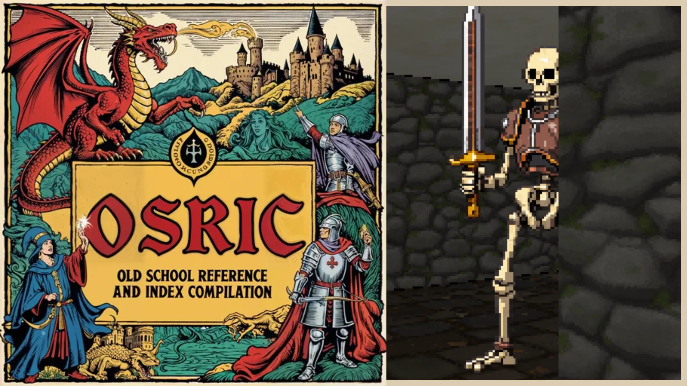

# OSRIC Engine and Game(s)

OSRIC, short for Old School Reference and Index Compilation, is a fantasy role-playing game system and a remake of the 1st edition of Advanced Dungeons & Dragons (AD&D). The present game is a technical remake of Ultima Underworld.



## Rule-Engines & Renderer-Engines

In this repository, a core common engine is implemented as a **fixed stage pipeline** to be the core functionality of any kind of turn-based game.

OSRIC-engine uses this engine to be the complete set of commands & rules that implements the OSRIC ruleset.

In the same fashion, a game-independent custom visual engine, a **software raycaster**, is introduced to be the basis of any kind of First Person Dungeon Crawler game. It does NOT rely on any 2D/3D engine or library.

Rule-Engines & Renderer-Engines are thus meant to be co-located.

Then, Underworld, a technical showcase displaying the raycaster uses OSRIC to create the basis of a "Ultima Underworld"-like game.

Lastly, a distributable is provided as a dektop executable for Linux and a buildable for Windows.

## Repository layout

As stated, this is a pnpm workspace with multiple packages:

engine/
- Core simulation runtime and APIs.
- Fixed‑stage pipeline executor, effects buffer, and result types.
- Deterministic RNG with audit trails, integrity hashing, and snapshot diffing.
- Authoring DSL for commands, registry, and facade for clean integration.
- Batch/simulation utilities for scenario building and large‑scale runs.
- ZERO dependencies.

osric-engine/
- Deterministic OSRIC rules on top of the core engine.
- Exposes the DomainEngine facade, domain commands, entities, and scenarios.
- Mirrors certain battle effects into viewer-friendly ones.

renderer-underworld/
- Headless renderer and data structures for a software raycaster.
- Provides textures, palettes, LUTs, sprite helpers, and a simulation loop.
- Creates them when they are not provided.
- ZERO dependencies.

viewer-underworld/
- React based game to visualize the renderer-domain interactions.

distributable-underworld/
- Electron wrapper to ship a desktop version of the viewer-underworld game.

## Who this is for

- People building turn-based games who require strong guarantees and clear authoring flows.
- Designers implementing complex rulesets as modular, testable packages.
- People who value good documentation (see [Q&A](docs/engine-and-domain-qna.md)).

## Minimal example

```ts
import { DomainEngine, DomainMemoryStore } from '@osric/osric-engine';

const store = new DomainMemoryStore();
const engine = new DomainEngine({ seed: 12345, store });

// Execute domain commands by typed key
const res = engine.grantXp('hero-1', 50);
if (res.ok) {
  // effects are mirrored (e.g., battle visuals) and available on success
  console.log(res.effects);
}

// Dry-run safely without inducing store/RNG changes
const sim = engine.simulate('osric:grantXp', { id: 'hero-1', amount: 50 });
console.log(sim.diff);
```

## Development

- See [authoring-engine](docs/authoring-engine/01-overview.md)
- See [authoring-engine-domain](docs/authoring-engine-domain/01-overview.md)
- See [authoring-renderer](docs/authoring-renderer/01-overview.md)
- Run the viewer app
  - pnpm -w -F @osric/viewer-underworld dev

## License

MIT License © 2025 Fernando E. Braz
